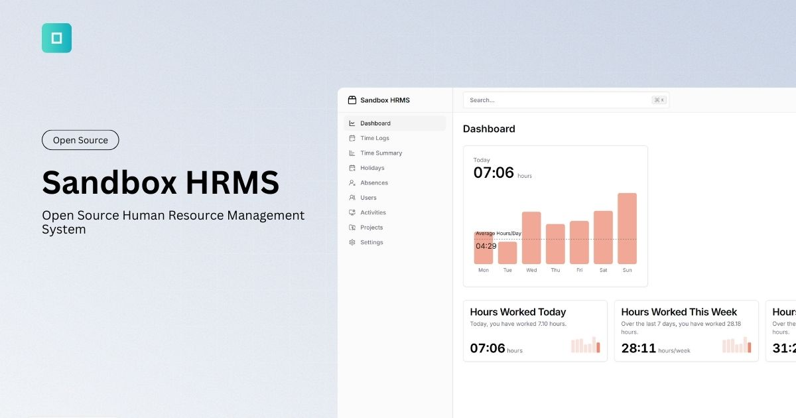
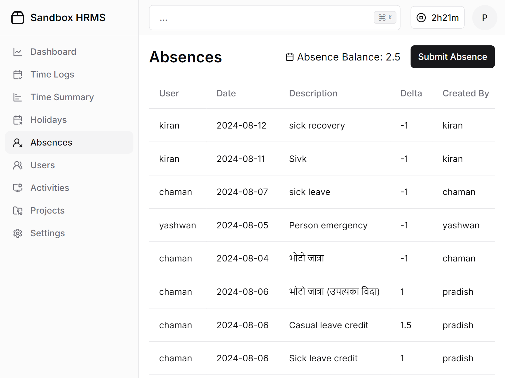
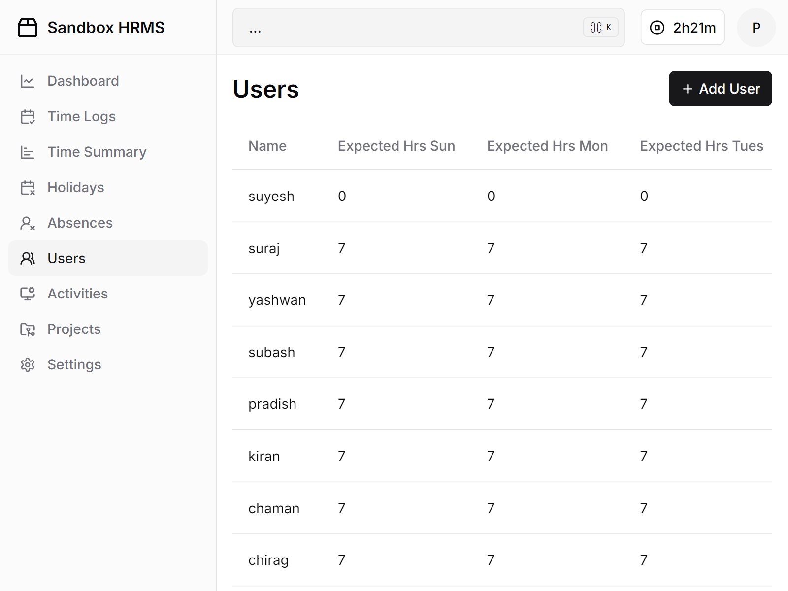
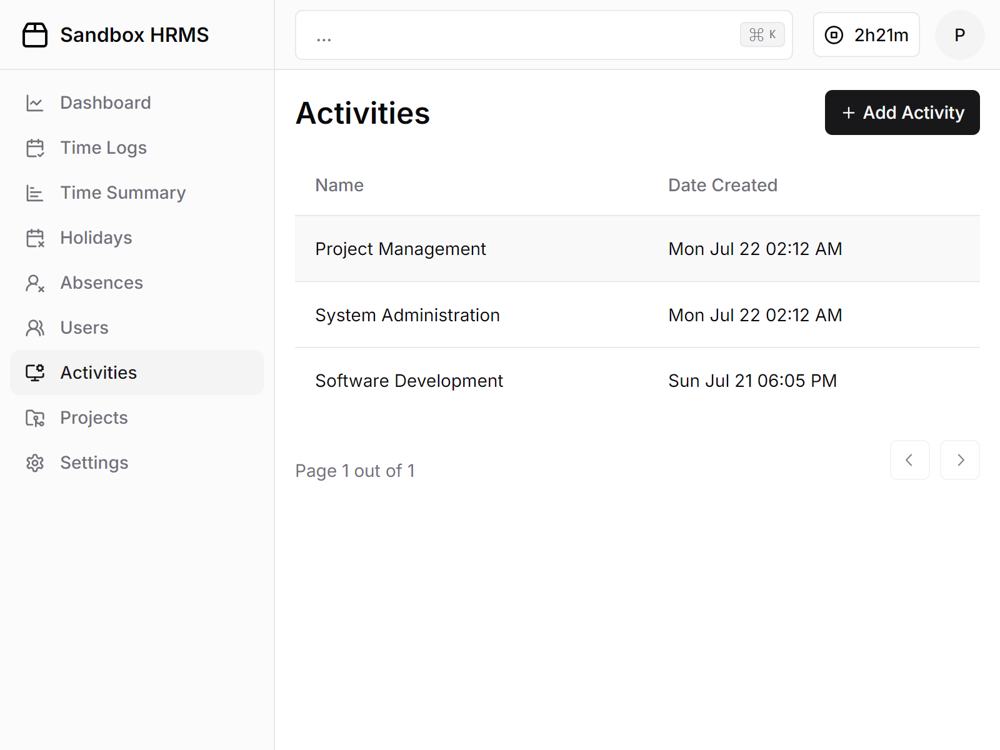

<p align="center" style="margin-top: 120px">
  <h3 align="center">Sandbox HRMS</h3>
  <p align="center">The Open Source Human Resource Management System</p>

  <p align="center">
  
  </a>
  </p>

</p>

## About Sandbox HRMS

Open Source, modern, and easy-to-use HRMS software for small and medium organizations developed by [Sandbox](https://sandbox.com.np).

## Getting Started 🚀

Run the following command to download the latest version of the docker compose file.
   ```sh
   curl https://raw.githubusercontent.com/sandbox-pokhara/hrms/refs/heads/master/docker-compose.sample.yml -o docker-compose.yml
   docker compose up
   ```

> [!IMPORTANT]
> Make sure to change the enviornment values before deploying.

## 🙌 Contributing

If you have any ideas for improvement, feel free to fork the repository, make your changes, and submit a pull request. Alternatively, you can open an issue with the "enhancement" label. And don’t forget to give the project a star—thank you for your support!

## Contributors ✨

<a href="https://github.com/sandbox-pokhara/hrms/graphs/contributors">
  
</a>


## 🖼 More Screenshots









## License

This project is licensed under the terms of the MIT license.
